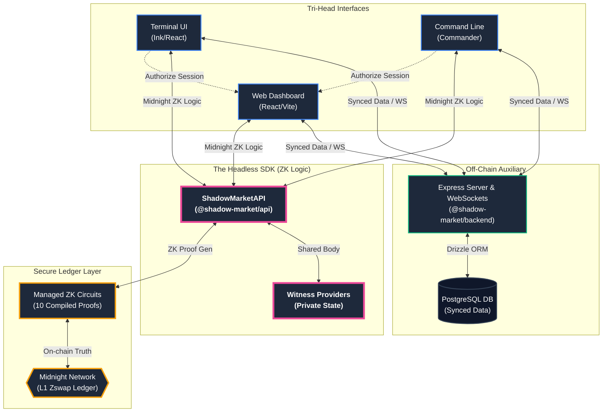

# Shadow Market: System Architecture & Compositing Strategy

The **Shadow Market** is a privacy-first decentralized prediction market built on the Midnight Network. It employs a modern **Compositing Architecture** designed for high throughput, professional-grade trading, and maximum user privacy.

---

## 1. The Compositing Core ("Tri-Head" Pattern)

The system is designed as a "Composite" where three distinct interfaces (Heads) interact with a single shared logic layer (SDK Body).

### A. The Web Head (`packages/web`)
A visual-first dashboard built for ease of use. It handles complex charting, social interactions, and market discovery.
- **Composition**: React 19 + Vite.
- **Role**: Primary interface for standard users.

### B. The Terminal Head (`packages/cli`)
A high-performance trading TUI (Terminal User Interface) built for power users who require keyboard-driven navigation and low-latency execution.
- **Composition**: Ink (React for CLI) + Commander.
- **Role**: Trading execution and advanced wallet management.

### C. The Server Head (`packages/backend`)
An off-chain auxiliary that manages transient data, database-backed indexing, and session synchronization.
- **Composition**: Express + Drizzle + PostgreSQL.
- **Role**: Market discovery, historical indexing, and TUI-to-Web pairing.

---

## 2. The "Headless" logic (`packages/api`)

The **Shadow Market SDK** acts as the shared connective tissue (the "Body") for the heads. It encapsulates:

- **Circuit Handlers**: Abstractions for the 10 Midnight ZK circuits (Market Creation, Betting, Wagers).
- **Witness Management**: Secure handling of private data used to generate proofs.
- **Multi-Head State Sync**: A unified Reactive (RxJS) state stream that all heads subscribe to for real-time ledger updates.

---

## 3. Compositing Layer: Data & Session Flow

The project utilizes a **Session Synchronization** layer to link the Terminal Head and Web Head without duplicating sensitive private keys.

### Session Pairing Flow
1. **Initiation**: The TUI requests a `PairingCode` from the Backend.
2. **Identification**: The User enters the code into the Web UI.
3. **Authorization**: The Web UI uses the connected wallet to sign a cryptographic challenge.
4. **Binding**: The Backend verifies the signature and binds the TUI session to the Wallet’s public address.

This "Compositing" technique allows for a seamless cross-device experience while maintaining the Zero-Knowledge security boundary.

---

## 4. Security & Privacy Boundaries

| Layer | Responsibility | Privacy Level |
| :--- | :--- | :--- |
| **Ledger (Midnight)** | Settlement, Truth, Pool Math | **Public Verified** |
| **SDK (Headless)** | Probative Proof Generation, Private State | **Strictly Private** |
| **Backend (Off-chain)** | Indexing metadata, Discovery | **Public Cache** |
| **Interfaces (Heads)** | Presentation, Interaction | **User-Local** |

---

## 5. Technical Stack Composition

- **Language**: TypeScript throughout for type-safety across package boundaries.
- **ZK Engine**: Midnight COMPACT for privacy-preserving contract logic.
- **Storage**: Drizzle ORM + PostgreSQL for high-speed off-chain queries.
- **React Ecosystem**: Used for both Web (Browser) and TUI (Terminal) components, sharing a similar declarative mental model.
