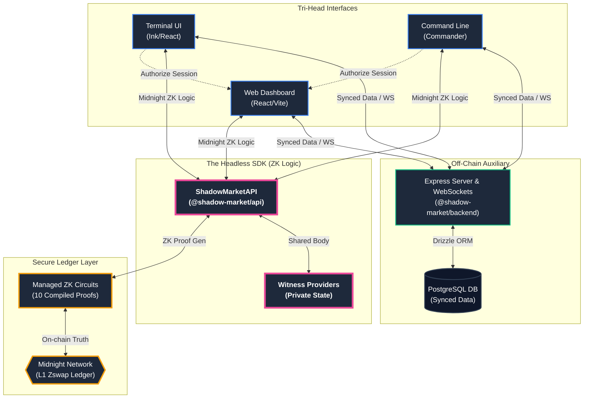
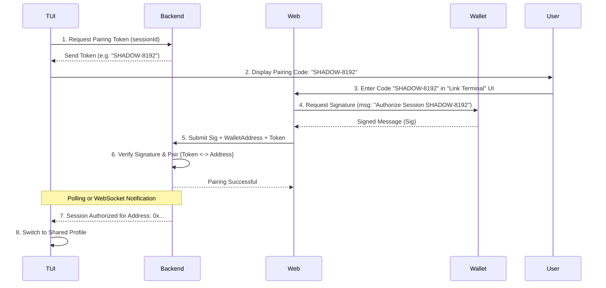

# Shadow Market: System Architecture & Compositing Strategy

The **Shadow Market** is a privacy-first decentralized prediction market built on the Midnight Network. It employs a modern **Compositing Architecture** designed for high throughput, professional-grade trading, and maximum user privacy using Zero-Knowledge proofs.

---

## 1. The Compositing Core ("Tri-Head" Pattern)

The system is designed as a "Composite" where three distinct interfaces (Heads) interact with a single shared logic layer (SDK Body). This ensures feature parity and logic consistency across all platforms.

### A. The Web Head (`packages/web`)
A visual-first dashboard built for ease of use. It handles complex charting, social interactions, and market discovery.
- **Composition**: React 19 + Vite + Tailwind CSS.
- **Experience**: High-fidelity trading UI with real-time order books and portfolio tracking.

### B. The Terminal Head (`packages/cli`)
A high-performance trading TUI (Terminal User Interface) built for power users who require keyboard-driven navigation and low-latency execution.
- **Composition**: Ink (React for CLI) + Commander.
- **Experience**: "Vim-like" navigation, dedicated wallet management, and lightning-fast wager placement.

### C. The Server Head (`packages/backend`)
An off-chain auxiliary that manages transient data, database-backed indexing, and session synchronization.
- **Composition**: Express + Drizzle + PostgreSQL + WebSockets.
- **Role**: Market discovery, historical indexing, and TUI-to-Web pairing synchronization.

---

## 2. The "Headless" Logic (`packages/api`)

The **Shadow Market SDK** acts as the shared connective tissue (the "Body") for the heads. It encapsulates the complex Zero-Knowledge logic required by Midnight.

- **Circuit Handlers**: Abstractions for the 10 Midnight ZK circuits including Market Creation, Betting, and P2P Wager settlement.
- **Witness Management**: Secure handling of private data used to generate proofs without revealing secrets to the UI layer.
- **Multi-Head State Sync**: A unified Reactive (RxJS) state stream that all heads subscribe to for real-time ledger updates.

---

## 3. Compositing Layer: Data & Session Flow

To ensure the user's **Terminal (TUI)** and **Web Frontend** are operating on the same account securely, we implement an **Assigned Session Authorization** flow. This allows the Terminal to "Pair" with a Web-connected wallet without transferring private keys.

### Technical Flow

### Security Considerations
- **No Key Sharing**: Private keys never leave their respective environments (Browser Extension vs. TUI Memory).
- **Timeboxing**: Pairing tokens expire quickly (5 mins) to prevent hijacking.
- **Single-Use**: Once a pairing is successful, the token is invalidated immediately.

---

## 4. Security & Privacy Boundaries

| Layer | Responsibility | Privacy Level |
| :--- | :--- | :--- |
| **Ledger (Midnight)** | Settlement, State Truth, Pool Logic | **Publicly Verifiable** |
| **SDK (Headless)** | Zero-Knowledge Proof Generation | **Strictly Private** |
| **Backend (Off-chain)** | Discovery, Indexing, Pairing | **Public Cache** |
| **Interfaces (Heads)** | Presentation, User Interaction | **User-Local** |

---

## 5. Technical Stack Composition

- **Language**: TypeScript (Strict Mode) across all packages.
- **ZK Engine**: Midnight COMPACT for privacy-preserving contract logic.
- **Storage**: Drizzle ORM + PostgreSQL for high-performance off-chain queries.
- **React Ecosystem**: Unified declarative model for both Web (Browser) and TUI (Terminal).
- **Protocol**: Custom JSON-RPC + WebSocket stream for real-time updates.

---

**Shadow Market | Project Sigil Protocol v4.0**
