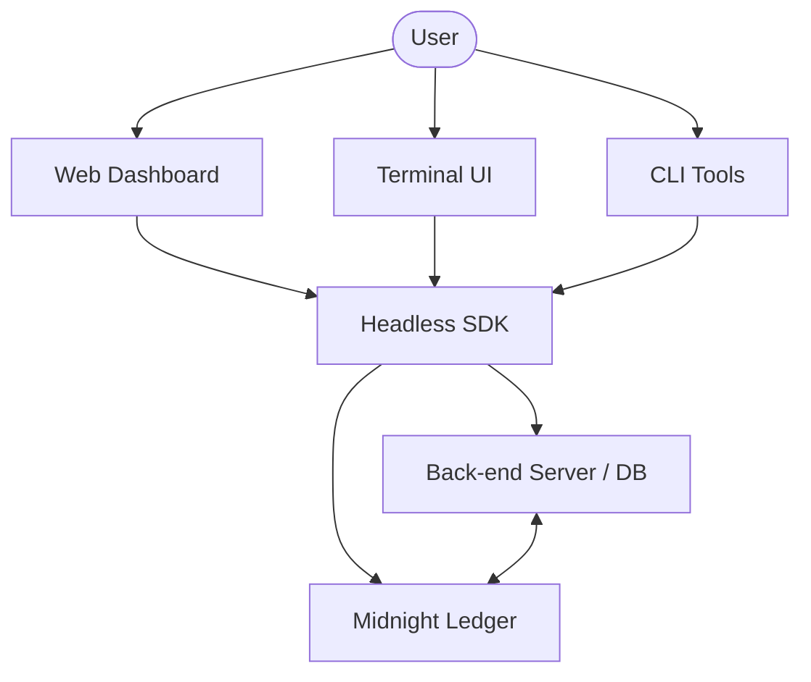

# Shadow Market: System Architecture

The **Shadow Market** is a privacy-first decentralized prediction market built on the Midnight Network, using Zero-Knowledge Proofs (ZKP) to ensure that market participants' identities and trade details remain private while ensuring that the settlement is verifiable.

## 1. The Tri-Head Architecture

The project follows a "Tri-Head" architectural pattern, where a central "Headless" SDK (Core API) provides consistent logic across three distinct user interfaces:

### A. The Web Head (`packages/web`)
A modern, feature-rich React dashboard built with Vite. It is designed for everyday users who want a rich, visual trading experience.
- **Tech Stack**: React, TypeScript, Vite, Tailwind CSS.

### B. The Terminal Head (`packages/cli`)
A high-performance trading terminal (TUI) for power traders who prefer a low-latency, "Bloomberg terminal" style experience.
- **TUI**: Built using **Ink** (React for the terminal) for a responsive, interactive CLI.
- **CLI**: Standard command-line tools for automation and DevOps.

### C. The Server Head (`packages/backend`)
An off-chain companion that manages transient data, database-backed indexing, and real-time state synchronization via WebSockets.
- **Off-chain DB**: Drizzle ORM managing market discovery and historical data.

---

## 2. Core Logic (The Headless SDK)

Located in `packages/api`, the Core Logic layer ensures that no matter which "Head" you use, the underlying business rules and on-chain interactions are identical.

- **Handlers**: State machines that manage transaction flows (Market Creation, Wager Placement, Claiming).
- **Witnesses**: Private data inputs for the Midnight ZK circuits.
- **Providers**: abstractions for Wallets, Data Indexers, and Circuit Provers.

---

## 3. The Ledger (The On-Chain Core)

Located in `/packages/contracts`, the Midnight ledger holds the source of truth for the protocol.

- **COMPACT Language**: The smart contract logic that enforces the rules of the Shadow Market.
- **Managed Code**: Automatically generated TypeScript bindings that allow the SDK to interact with the ZK circuits.
- **ZKP Circuits**: The circuits that generate proofs for market creation and secret outcomes.

---

## 4. Communication Flow

---

## 5. Security & Privacy Model

The Shadow Market utilizes Midnight’s unique **Public/Private state separation**:
- **Public State**: Market metadata, total pool volume, and expiration times.
- **Private State**: Individual bet amounts, user identities, and settlement proofs.
