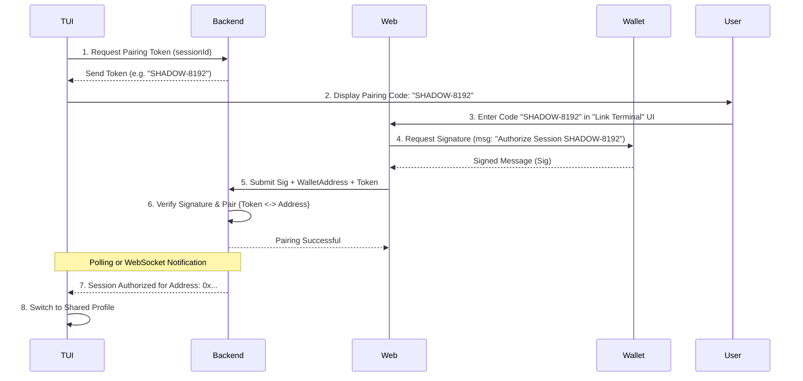

# Terminal & Web Session Synchronization Flow

To ensure the user's **Terminal (TUI)** and **Web Frontend** are operating on the same account (wallet address), we implement an **Assigned Session Authorization** flow. 

This flow allows the Terminal to "Pair" with a Web-connected wallet securely without transferring private keys.

---

## 🏗️ Technical Flow

---

## 🛠️ Implementation Details

### 1. The Pairing Token (Backend)
The backend generates a short-lived (e.g., 5-minute), high-entropy alphanumeric code (e.g., `ABCD-1234`). This code is associated with a temporary session entry in the database.

### 2. Signature Verification (EIP-191 / Web3)
The Web Head uses the connected wallet (e.g., Midnight DApp Connector) to sign the string:
`"I authorize this Shadow Market terminal session: [PairingToken]"`

The backend verifies the signature using the user's public key (Wallet Address). This ensures that only the owner of the address can authorize a specific terminal session.

### 3. State Synchronization
Once paired, the Backend can push "User Metadata" (Avatar, Preferences, Custom Lists) from the Web profile down to the TUI via the shared **WebSocket** connection. 

This ensures that actions taken in the TUI (like placing a bet) are immediately reflected in the Web UI, and vice versa.

---

## 🔒 Security Considerations

- **No Key Sharing**: Private keys never leave their respective environments (TUI or Wallet). 
- **Timeboxing**: Tokens expire quickly to prevent hijacking of old sessions.
- **Single-Use**: Once a pairing is successful, the token is invalidated immediately.
- **Encryption**: All communication is conducted over TLS to prevent code sniffing.
